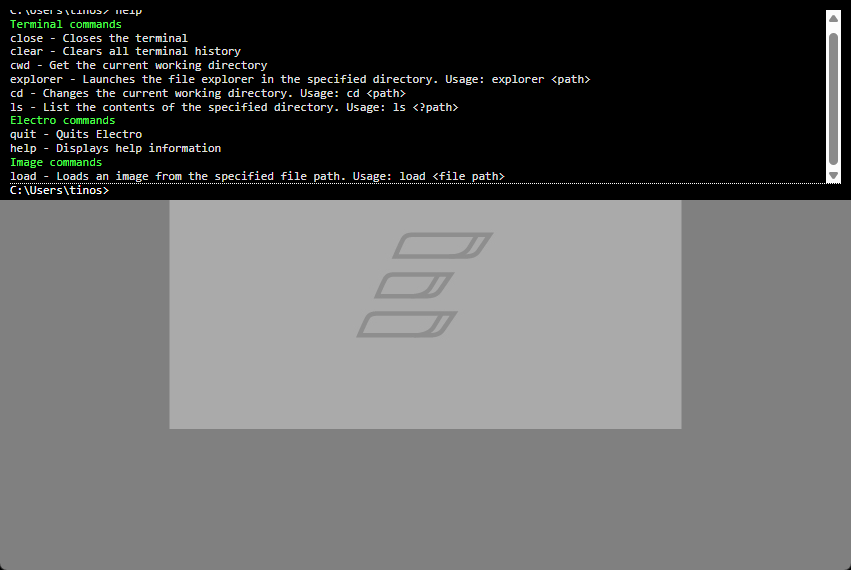

  

# Electro - A lightweight & blazingly-fast image viewer

## Features

### 👀 Overview

| Feature                                     | Electro | Default Image Viewer |
| ------------------------------------------- | ------- | -------------------- |
| ⚡ Ultra-fast performance                    | ✅       | ❌                    |
| 🧑‍💻 Developer-first experience                | ✅       | ❌                    |
| 🚀 Built-in command terminal                 | ✅       | ❌                    |
| 🌍 Open-source                               | ✅       | ❌ (probably)         |
| ⛓️‍💥 View local & web-hosted images instantly | ✅       | ❌                    |

### ⚡ Ultra-fast performance

Electro is built with Rust, and designed with sheer performance in mind. Everything is designed to be as fast as possible, so you can view images without any loading times or lag.

### 🧑‍💻 Developer-first experience

Built by developers for developers; Electro is extremely lightweight, fast, and has a terminal built-in!

### 🚀 Built-in command terminal

Electro includes a custom built-in terminal with custom commands to ensure 10x productivity. (Press `t` to open the terminal!)

### 🌍 Open-source

Electro is open-source, and will always be open-source. You can view the source code, contribute, and even build your own version of Electro!

### ⛓️‍💥 View local & web-hosted images instantly

No need to download images to view them! Electro supports loading images from the web, so you can view them without needing to download anything.

## Installation

1. Download the latest release from the [releases page](https://github.com/pTinosq/Electro/releases)
2. Run the installer
3. That's it! You're ready to go - just open an image with Electro!

## Getting Started

When running the installer, Electro should automatically set itself as the default image viewer. Open an image with Electro to get started!

The most helpful keybind of all is `t`, which opens the terminal. From there, you can begin exploring the terminal commands with `help`.

## Screenshots

ℹ️ **Screenshots may not reflect the latest version.**  
⚠️ **GIFs do not capture Electro's full performance - expect even smoother results in real use.**

## Contributing

Want to improve Electro? Contributions are welcome!  

- **Report bugs** or suggest features on the [issues page](https://github.com/pTinosq/Electro/issues).
- **Submit a pull request** with your improvements.

## License

Electro is licensed under the GPL-3.0 license. See the [LICENSE](./LICENSE) file for more information.
